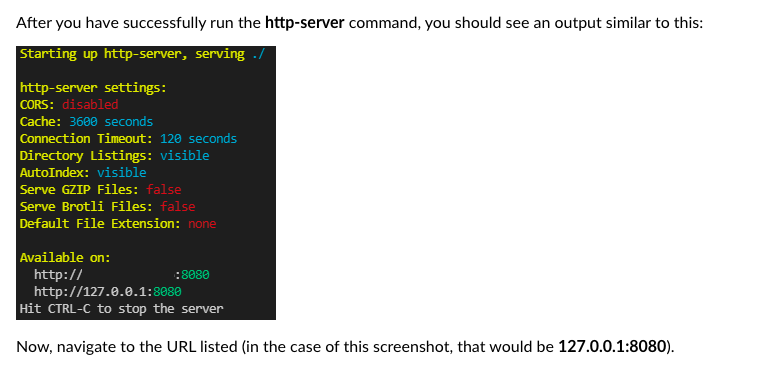

# BadBankFJ

I created a dynamic webpage for my class project that shows fake users that can create accounts on a banking app, log into it, deposit, withdraw and it also shows all of the data of the users. 

Technology: 

- JavaScript
- React 
- Node
- HTML

To run the webpage on your local server: 

- Clone the repository to your local laptop or desktop
- Install node.js
- CD into this folder on the terminal
- Then run this into the terminal: npm install -g http-server
- Then run this: http-server 
- Then you should see something like this: 

Now, navigate to the URL listed (in the case of this screenshot, that would be 127.0.0.1:8080 or http://192.168.1.153:8080).

## MIT License
Copyright (c) 2021 MIT

Permission is hereby granted, free of charge, to any person obtaining a copy of this software and associated documentation files (the "Software"), to deal in the Software without restriction, including without limitation the rights to use, copy, modify, merge, publish, distribute, sublicense, and/or sell copies of the Software, and to permit persons to whom the Software is furnished to do so, subject to the following conditions:

The above copyright notice and this permission notice shall be included in all copies or substantial portions of the Software.

THE SOFTWARE IS PROVIDED "AS IS", WITHOUT WARRANTY OF ANY KIND, EXPRESS OR IMPLIED, INCLUDING BUT NOT LIMITED TO THE WARRANTIES OF MERCHANTABILITY, FITNESS FOR A PARTICULAR PURPOSE AND NONINFRINGEMENT. IN NO EVENT SHALL THE AUTHORS OR COPYRIGHT HOLDERS BE LIABLE FOR ANY CLAIM, DAMAGES OR OTHER LIABILITY, WHETHER IN AN ACTION OF CONTRACT, TORT OR OTHERWISE, ARISING FROM, OUT OF OR IN CONNECTION WITH THE SOFTWARE OR THE USE OR OTHER DEALINGS IN THE SOFTWARE.
